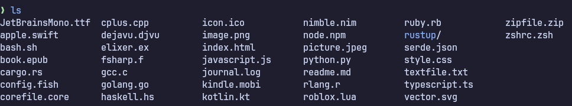
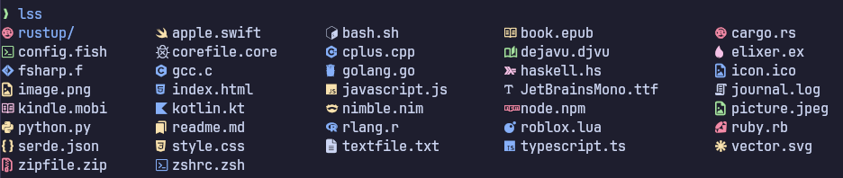

# LSS - LS on Steroids

Personal project to test out nim and improved file sorting to the original ls command + pretty icons.

## Original LS command 🥱


## vs on Steroids 💉


## Why another ls rewrite?
No **real** reason why. It is not a very good project, or even feature-complete. Mainly just made it for myself, but there's nothing stopping you from using it if you want to. The best argument that can be made is that the regular ls command lists *everything* alphabetically, which can often seem messy or clustered. This rewrite will alphabetically sort first the directories, then the executables and finally the rest of the files in alphabetical order to give an overall more 'clean' output. (the icons look pretty too)

## Prerequisites
A  must be installed and set as the default terminal font.

# Installation
1. Clone the repo
```git clone https://github.com/Houdiee/lss```

2. Move the binary to your local bin
```mv ~/lss/lss ~/.local/bin/```

3. Ensure that ```~/.local/bin/``` is in your system PATH.

You can now freely run the ```lss``` command and if you want remove the cloned git repo.
